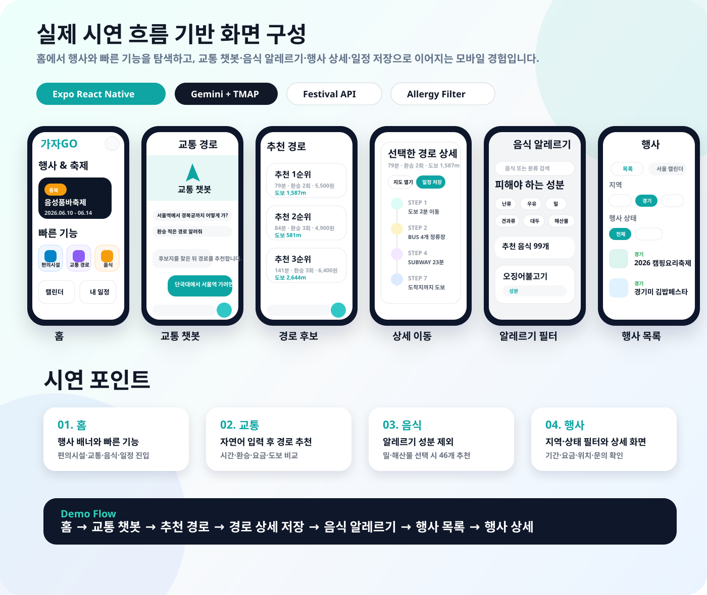

<p align="center">
  
</p>

<h2 align="center">가자GO</h2>

<p align="center">
  <b>AI 자연어 이해 · TMAP 실시간 교통 데이터 · 지역 행사 정보를 연결한 외국인 한국 여행 지원 모바일 앱</b>
</p>

<p align="center">
  
  
  
  
</p>

---

## 1. 프로젝트 소개

가자GO는 한국을 방문한 외국인이 여행 중 자주 겪는 정보 탐색 문제를 하나의 모바일 앱에서 해결하기 위해 만든 서비스입니다.

홈 화면에서 행사와 빠른 기능을 탐색하고, 자연어 교통 챗봇으로 이동 경로를 추천받으며, 음식 알레르기 성분을 필터링하고, 행사 상세 정보와 일정을 함께 관리할 수 있습니다.

### 핵심 가치

- 여행 중 필요한 행사, 교통, 음식, 편의시설, 일정을 하나의 앱에서 연결
- 자연어 입력을 실제 교통 경로 후보로 변환
- 알레르기 성분 기반 음식 추천으로 외국인 여행자의 안전한 식사 선택 지원
- 저장한 행사와 교통 경로를 일정 관리 흐름에 연결

---

## 2. 시연 화면

<p align="center">
  
</p>

| 화면 | 시연 내용 |
| --- | --- |
| 홈 | 행사 & 축제 배너, 빠른 기능, 캘린더, 내 일정 진입 |
| 교통 챗봇 | “단국대학교에서 서울역 가려면 짐이 많은데 어떻게 가?” 같은 자연어 요청 입력 |
| 추천 경로 | 소요 시간, 환승 수, 요금, 도보 거리를 기준으로 1~3순위 경로 비교 |
| 경로 상세 | 도보, 버스, 지하철 이동 단계를 순서대로 표시하고 일정 저장 지원 |
| 음식 알레르기 | 난류, 우유, 밀, 해산물 등 제외 성분 선택 후 안전한 음식 목록 필터링 |
| 행사 목록 | 지역과 행사 상태를 기준으로 축제 목록 필터링 |
| 행사 상세 | 행사 이미지, 기간, 요금, 위치, 문의, 소개 정보 확인 |

---

## 3. 주요 기능

### 행사 & 축제 탐색

- 지역과 진행 상태를 기준으로 행사 목록을 필터링합니다.
- 행사 상세 화면에서 기간, 위치, 문의 정보, 소개 내용을 확인할 수 있습니다.
- 관심 있는 행사를 저장하고 일정에 추가할 수 있습니다.

### AI 교통 경로 추천

- 사용자가 자연어로 이동 상황을 입력하면 출발지, 목적지, 조건을 추출합니다.
- Gemini 분석 결과와 TMAP 대중교통 데이터를 이용해 여러 경로 후보를 비교합니다.
- 소요 시간, 환승 수, 요금, 도보 거리 기준으로 추천 순위를 제공합니다.
- 선택한 경로의 이동 단계를 상세하게 확인하고 일정에 저장할 수 있습니다.

### 음식 알레르기 필터링

- 난류, 우유, 밀, 메밀, 견과류, 대두, 갑각류, 해산물 등 피해야 할 성분을 선택합니다.
- 선택한 성분이 포함되지 않은 음식 목록을 추천합니다.
- 음식별 주요 재료와 조리 분류를 확인할 수 있습니다.

### 주변 편의시설 탐색

- 현재 위치를 기준으로 주변 은행, ATM, 편의점, 화장실 등 편의시설을 조회합니다.
- 카테고리별 목록과 거리 정보를 확인할 수 있습니다.

### 일정 관리

- 행사, 교통 경로, 직접 입력한 메모를 일정에 저장합니다.
- 오늘 일정과 월간 캘린더에서 저장한 내용을 확인합니다.
- 일정과 메모를 등록, 수정, 삭제할 수 있습니다.

---

## 4. 기술 스택

| 영역 | 기술 |
| --- | --- |
| Mobile Frontend | React Native, Expo, TypeScript |
| Navigation | React Navigation |
| Storage | AsyncStorage |
| Location | Expo Location |
| Auth | JWT Authentication |
| Backend API | Spring Boot API |
| AI / Transport API | FastAPI, Gemini, TMAP |
| Build | EAS Build |

---

## 5. API 연동 구조

프론트엔드는 `EXPO_PUBLIC_API_BASE_URL`에 설정된 서버 주소를 기준으로 API를 호출합니다.

- 공통 API 클라이언트: `src/app/api/client.ts`
- 인증 토큰 저장소: AsyncStorage
- 인증 요청 방식: `Authorization: Bearer <token>`
- 기능별 API 모듈: `auth`, `festival`, `food`, `facilities`, `transport`, `userContent`

```text
App
├── Spring Boot API
│   ├── 회원 인증 / JWT
│   ├── 행사·음식·일정 데이터
│   └── 편의시설·교통 요청 중계
└── FastAPI AI/Transport API
    ├── Gemini 자연어 분석
    └── TMAP POI / Transit API 연동
```

---

## 6. 프로젝트 구조

```text
src/app
├── api              # 백엔드 API 호출 모듈
├── components       # 공통 UI 및 기능별 컴포넌트
├── data             # 화면용 정적/임시 데이터
├── hooks            # 기능별 커스텀 훅
├── screens          # 앱 화면 단위 컴포넌트
├── utils            # 날짜 등 공통 유틸
├── App.tsx          # 앱 진입 및 네비게이션 구성
├── routes.ts        # 라우트 이름 정의
└── theme.ts         # 색상/디자인 토큰
```

---

<p align="center">
  
</p>
